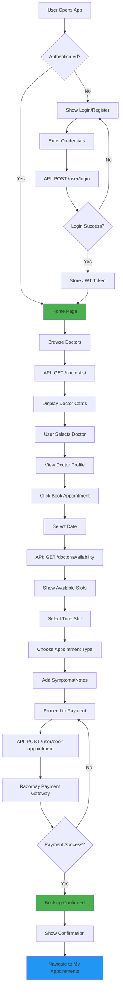
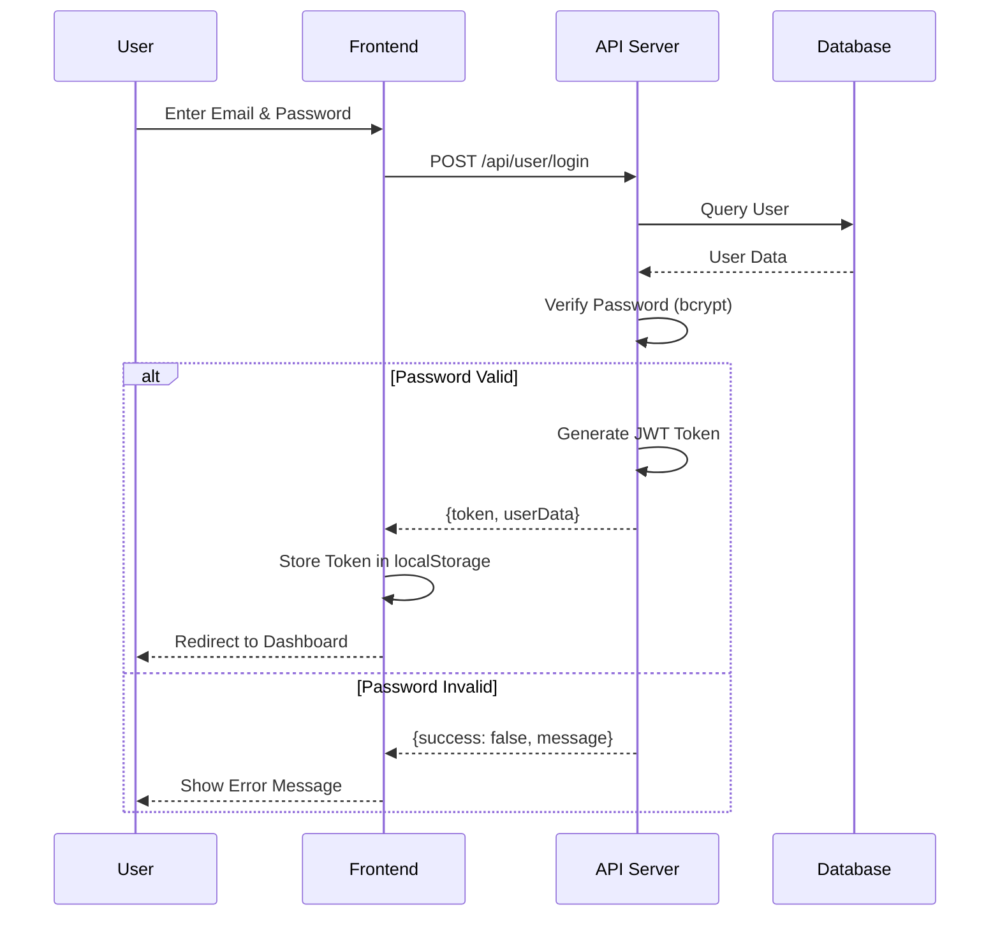
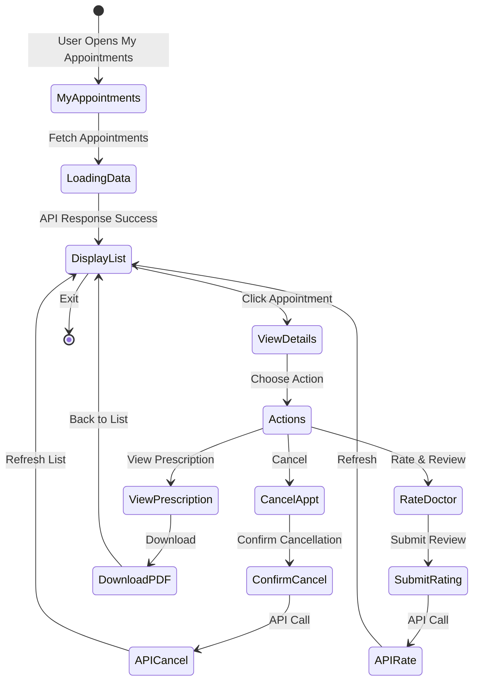

<<<<<<< HEAD
# Healhub Frontend - Patient Booking Platform

A modern, responsive React application for patients to discover doctors, hospitals, and book medical appointments.

## 🎯 Features

### Patient Features
- **Doctor Discovery**
  - Browse all doctors
  - Filter by speciality
  - View doctor profiles and ratings
  - See appointment fees and availability

- **Hospital Browsing**
  - Explore registered hospitals
  - View hospital profiles
  - Check available rooms and beds
  - View hospital specialties

- **Appointment Booking**
  - Real-time slot availability
  - Choose appointment type (video/in-person)
  - Add symptoms and notes
  - Secure payment with Razorpay

- **Appointment Management**
  - View upcoming appointments
  - Cancel or reschedule
  - Access prescriptions
  - Download medical records

- **Health Resources**
  - Read health blogs
  - Filter by category
  - View doctor/hospital articles
  - Health tips and awareness

- **User Profile**
  - Manage personal information
  - Track medical history
  - Save preferences
  - View booking history

## � Application Flow

### User Booking Flow



### Authentication Flow



### Appointment Management Flow



## �📋 Prerequisites

- Node.js 14+
- npm or yarn
- Modern web browser

## 🚀 Installation

```bash
# Navigate to frontend directory
cd frontend

# Install dependencies
npm install

# Create environment file
cp .env.example .env

# Update .env with your configuration
# VITE_BACKEND_URL=http://localhost:4000

# Start development server
npm run dev

# Build for production
npm run build

# Preview production build
npm run preview
```

## 🔧 Available Scripts

```bash
npm run dev       # Start development server (port 5173)
npm run build     # Build for production
npm run lint      # Run ESLint
npm run preview   # Preview production build
npm run build-only  # Build without preview
```

## 📁 Project Structure

Additional components added:
- `StatsButtons.jsx` – shows user/doctor/hospital counters below header
- `StatsCarousel.jsx` – marquee displaying service features of the platform
- Rating modal logic incorporated into `MyAppointments.jsx`


```
frontend/
├── src/
│   ├── components/
│   │   ├── Navbar.jsx          # Navigation bar
│   │   ├── Footer.jsx          # Footer component
│   │   ├── Header.jsx          # Page header
│   │   ├── SpecialityMenu.jsx  # Doctor speciality filter
│   │   ├── Banner.jsx          # Promotional banner
│   │   ├── RelatedDoctors.jsx  # Related doctors list
│   │   └── ...
│   ├── pages/
│   │   ├── Home.jsx            # Homepage with FAQ
│   │   ├── Doctors.jsx         # Doctor listing and filter
│   │   ├── Hospitals.jsx       # Hospital listing
│   │   ├── HospitalProfile.jsx # Hospital details
│   │   ├── Appointment.jsx     # Booking page
│   │   ├── MyAppointments.jsx  # Appointment management
│   │   ├── MyProfile.jsx       # User profile
│   │   ├── Login.jsx           # Authentication
│   │   ├── About.jsx           # About page
│   │   ├── Contact.jsx         # Contact page
│   │   ├── Blogs.jsx           # Blog listing
│   │   └── BlogPost.jsx        # Blog details
│   ├── context/
│   │   └── AppContext.jsx      # Global state management
│   ├── assets/
│   │   ├── assets.js           # Asset imports
│   │   └── images/
│   ├── App.jsx                 # Root component
│   ├── main.jsx                # Entry point
│   └── index.css               # Global styles
├── public/
├── index.html
├── vite.config.js
├── package.json
└── .env.example
```

## 🔌 API Integration

### Authentication
- JWT token-based authentication
- Stored in localStorage as `token`
- Sent in Authorization header for protected routes

### Key API Endpoints

**Doctors**
```javascript
GET  /api/doctor/list              // Get all doctors
GET  /api/doctor/{docId}           // Get doctor details
GET  /api/doctor/availability      // Get available slots
```

**Users (Patients)**
```javascript
POST /api/user/register            // User registration
POST /api/user/login               // User login
GET  /api/user/profile             // Get user profile
POST /api/user/update-profile      // Update profile
GET  /api/user/appointments        // Get user appointments
POST /api/user/book-appointment    // Book appointment
POST /api/user/cancel-appointment  // Cancel appointment
```

**Hospitals**
```javascript
GET  /api/hospital/list            // Get all hospitals
GET  /api/hospital/{hospitalId}    // Get hospital details
GET  /api/hospital/doctors         // Get hospital doctors
GET  /api/bed/availability         // Get room availability
```

**Blogs**
```javascript
GET  /api/blog/list                // Get all blogs
GET  /api/blog/{slug}              // Get blog post
GET  /api/blog/category/:category  // Filter by category
```

## 🏗️ Component Architecture

### Context API
- `AppContext`: Global state for user, doctors, and app-wide data
- Provides: `token`, `userData`, `doctors`, `currencySymbol`, utility functions

### Key Components

**Navbar**
- Navigation links
- User authentication status
- Profile dropdown
- Responsive mobile menu

**SpecialityMenu**
- Filter doctors by speciality
- Navigate to filtered doctor list
- Responsive grid layout

**DoctorCard**
- Doctor image and info
- Speciality and rating
- Appointment fee
- Click to view profile

**AppointmentSlots**
- Date picker
- Time slot selector
- Real-time availability
- Visual feedback

**MyAppointments**
- List user appointments
- Filter by status
- Reschedule option
- View prescriptions
- Cancel appointments

## 🎨 Styling

- **Tailwind CSS**: Utility-first CSS framework
- **Custom CSS**: Global styles in `index.css`
- **Responsive Design**: Mobile-first approach
- **Color Variables**: Customizable theme colors

## 🔐 Authentication Flow

```
User Login
    ↓
Submit credentials to /api/user/login
    ↓
Receive JWT token
    ↓
Store in localStorage
    ↓
Include in API requests
    ↓
Verify token in AppContext
```

## 💳 Payment Integration

### Razorpay Setup
1. Initialize Razorpay in index.html
2. Create order on backend
3. Open Razorpay payment window
4. Verify payment on backend
5. Create appointment after verification

## 📱 Responsive Design

- **Mobile**: Full-width, single column
- **Tablet**: 2-column layout
- **Desktop**: Multi-column with sidebars
- **Large screens**: Optimized spacing

## 🚀 Performance Optimization

- Lazy loading of images
- Code splitting with React Router
- Optimized API calls
- Efficient re-renders with context
- Minified production builds

## 🌐 Browser Support

- Chrome (latest)
- Firefox (latest)
- Safari (latest)
- Edge (latest)

## ♿ Accessibility

- Semantic HTML
- ARIA labels where needed
- Keyboard navigation
- Color contrast compliance
- Focus management

## 📊 State Management

### Global Context
```javascript
const {
  token,              // Auth token
  userData,           // User profile data
  doctors,            // Doctor list
  currencySymbol,     // Currency display
  backendURL,         // API base URL
  getDoctorsData,     // Fetch doctors
  loadUserProfileData // Fetch user profile
} = useContext(AppContext);
```

## 📦 Dependencies

Core Dependencies:
- `react` - UI library
- `react-dom` - DOM rendering
- `react-router-dom` - Routing
- `axios` - HTTP client
- `react-toastify` - Toast notifications
- `lucide-react` - Icon library
- `tailwindcss` - Styling

## 🌍 Environment Variables

```bash
VITE_BACKEND_URL=http://localhost:4000
VITE_API_TIMEOUT=30000
VITE_APP_NAME=Healhub
```

## 🐛 Common Issues

### Port 5173 Already in Use
```bash
npm run dev -- --port 5174
```

### CORS Errors
- Check backend CORS configuration
- Verify `VITE_BACKEND_URL` is correct
- Ensure backend is running

### Images Not Loading
- Verify Cloudinary configuration
- Check image URLs in API responses
- Check network tab in DevTools

## 📚 Useful Resources

- [React Documentation](https://react.dev)
- [Tailwind CSS](https://tailwindcss.com)
- [React Router](https://reactrouter.com)
- [Axios Documentation](https://axios-http.com)

## 🚀 Deployment

### Vercel
```bash
npm run build
# Deploy from vercel.json configuration
```

### Netlify
```bash
npm run build
# Deploy build folder
```

### Environment Setup for Production
```bash
VITE_BACKEND_URL=https://api.healhub.com
VITE_API_TIMEOUT=30000
```

## 📄 License

MIT License - See root LICENSE file

## 🤝 Support

For issues:
1. Check console for errors
2. Verify API connectivity
3. Check authentication token
4. Review network requests

---

**Happy Booking! 🏥**
=======
# Healhub
>>>>>>> 72f58c3285845301c75eb3953e45306e1101044c
